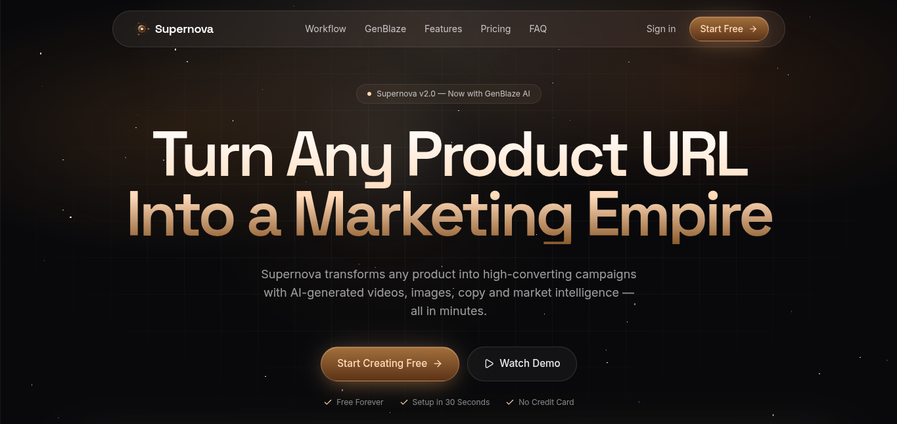

<div align="center">

# 

# Supernova Landing

**Premium AI Marketing Platform Landing Page**

_A modern, high-converting landing page for the Supernova AI Marketing Platform — turning any product URL into a marketing empire._

<br />


<br />

<!-- GitHub Readme Typing SVG -->
<p align="center">
  
</p>

</div>

---

## 📖 Project Overview

This repository contains the official **Supernova Landing Page** — a premium, production-ready marketing website for the Supernova AI Marketing Platform.

Supernova transforms any product URL into a complete marketing empire with AI-generated videos, images, copy, and market intelligence — all in minutes.

### What This Landing Page Showcases

- ✨ **Product Features** — Comprehensive feature highlights with interactive demos 
- ⚡ **AI Workflow** — Visual representation of the intelligent marketing pipeline
- 🎨 **Technology Stack** — Modern tech with cutting-edge animations
- 📱 **User Experience** — Fully responsive, accessibility-focused design
- 💰 **Pricing** — Clear, transparent pricing tiers
- 🎯 **Call-to-Actions** — Strategic conversion-focused design
- 🎬 **Framer Motion Animations** — Smooth, delightful micro-interactions

---

## 📸 Screenshot



---

## 🌐 Live Experience

| Link | Description |
|------|-------------|
| 🌐 **Landing Website** | [https://landing-supernova.vercel.app/](https://landing-supernova.vercel.app/) |
| 🚀 **Main Application** | [https://appsupernova.vercel.app/auth](https://appsupernova.vercel.app/auth) |
| 📖 **Engineering Journal** | [https://journal-supernova.vercel.app/](https://journal-supernova.vercel.app/) |
| 🎤 **Pitch Deck** | [https://pitch-deck-supernova.vercel.app/](https://pitch-deck-supernova.vercel.app/) |
| 🐙 **Main Repository** | [https://github.com/robloxsagax-web/Supernova](https://github.com/robloxsagax-web/Supernova) |

---

## ✨ Features

<div align="center">

| Feature | Description |
|---------|-------------|
| ✨ **Modern SaaS Design** | Premium, professional design aesthetic |
| ⚡ **Lightning Fast** | Optimized performance with Vite + React 19 |
| 🎨 **Premium UI/UX** | Polished user experience with micro-interactions |
| 📱 **Fully Responsive** | Perfect on all devices and screen sizes |
| 🎬 **Framer Motion** | Smooth, delightful animations throughout |
| ♿ **Accessibility** | WCAG-compliant with semantic HTML |
| 🌙 **Dark Mode** | Modern dark theme with warm accents |
| 🚀 **Production Ready** | Deployable out of the box |

</div>

---

## 🛠 Technology Stack

### Frontend

| Technology | Purpose |
|------------|---------|
| **React 19** | Latest React with concurrent features |
| **TypeScript** | Type-safe development |
| **Tailwind CSS v4** | Utility-first styling |
| **Framer Motion** | Declarative animations |
| **TanStack Start** | SSR-enabled React framework |
| **Radix UI** | Accessible UI primitives |

### Deployment

| Technology | Purpose |
|------------|---------|
| **Vercel** | Edge deployment & CDN |
| **Nitro** | Serverless functions |

### Design

| Technology | Purpose |
|------------|---------|
| **shadcn/ui** | Beautiful, accessible components |
| **Lucide Icons** | Consistent iconography |
| **Space Grotesk** | Display typography |
| **Inter** | Body typography |

---

## 🚀 Getting Started

### Prerequisites

- Node.js 18+ or Bun
- npm, yarn, or bun

### Installation

```bash
# Clone the repository
git clone https://github.com/robloxsagax-web/supernova-landing.git

# Navigate to the project
cd supernova-landing

# Install dependencies
npm install
# or
bun install

# Start the development server
npm run dev
# or
bun run dev
```

### Build for Production

```bash
# Create production build
npm run build

# Preview production build
npm run preview
```

---

## 📁 Project Structure

```
supernova-landing/
├── public/
│   ├── favicon.ico
│   ├── favicon.svg
│   ├── logo.png
│   └── landing.png
├── src/
│   ├── components/
│   │   ├── branding/
│   │   │   └── SupernovaLogo.tsx
│   │   └── ui/                      # shadcn/ui components
│   ├── hooks/
│   │   └── use-mobile.tsx
│   ├── lib/
│   │   ├── utils.ts
│   │   ├── error-capture.ts
│   │   ├── error-page.ts
│   │   └── lovable-error-reporting.ts
│   ├── routes/
│   │   ├── __root.tsx
│   │   ├── index.tsx
│   │   └── README.md
│   ├── router.tsx
│   ├── routeTree.gen.ts
│   ├── server.ts
│   ├── start.ts
│   └── styles.css
├── LICENSE
├── package.json
├── tsconfig.json
├── vite.config.ts
└── README.md
```

---

## 🏆 Ai Hackathon

<div align="center">

**Built for the Hackathon 2026**

This landing page represents the public-facing experience of the Supernova ecosystem — showcasing how AI can transform product marketing with unprecedented speed and quality.

</div>

---

## 📜 License

This project is licensed under the MIT License — see the [LICENSE](LICENSE) file for details.

---

<div align="center">

## Made with ❤️ using

[](https://react.dev)
[](https://www.typescriptlang.org)
[](https://tailwindcss.com)
[](https://www.framer.com/motion/)
[](https://vercel.com)

**Designed and developed by [Muhammad Mujtaba Ismail](https://github.com/robloxsagax-web)**

</div>
